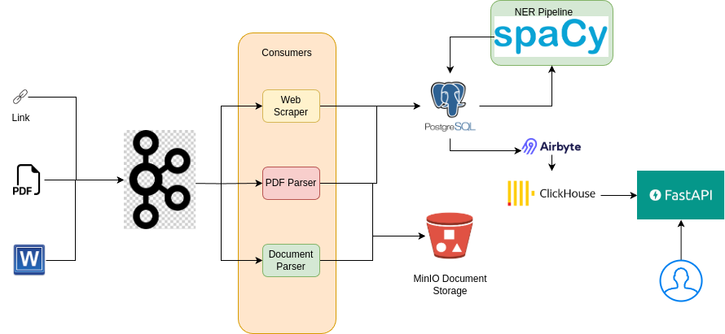

## Goal
Build a document ingestion and named entity recognition system using Python and spaCy.

### System Architecture

### Description

The system has primarily three components.

##### Ingestion
This component is responsible for ingesting the documents from different formats such as URL, PDF and word files. Depending on the detailed requirements, more
formats and file sources can be added, such as HTML, JSON etc. The assumption is, an upstream data delivery system can supply _newly_ available URL or documents (as binary data streams) as the correct topics in a Kafka cluster (the file format determines the topic name).

##### Parsers Running as Consumer Group
As each individual data source (depending on its format) requires customised processing, separate parsers are designed for HTML, pdf and word files. A _consumer group_ (Kafka concept) consists of replicated copies of the parser. As an example, we can have a consumer group called `PDFParser` running five replicas all of which subscribe to the `pdf` topic. This ensures the following advantages

* Each PDF documented published upstream is processed by exactly one consumer from the `PDFParser` group
* Allows asynchronous processing and independent scalability depending on file types. If there is a heavy inflow of PDF documents, we can spin up more PDFParsers (replicable via Kubernetes deployments)
* Rest of the processing pipeline remains decoupled from the file type concern. New types of parsers can be added or deprecated depending on requirements
* Resilient ingestion system without a single point of failure. As the system has multiple replicas of each consumer in a group, failure of any replica allows the system to continue operation and the Kubernetes scheduler guarantees restarting the failed replica to reconcile the state of the system.

##### Consumer Job Duties
All consumers (which also contain the parsers) are responsible for extracting the following fields from the document
* publication date
* title
* text body

To achieve it, the web scraper can use `beautifulsoup`, the PDF parser can use `pypdf` and the word document parser can use `python-docx` as some examples.

Further, the consumers, also calculate a deterministic unique ID for each document using a SHA2 digest of the above fields. So we have all the relevant fields for a document available at each consumer.

###### Advantage of SHA2 Digest
Distributed UUID without centralised coordination among the consumers. However, UUID can serve the purpose as well, without deterministic guarantee, but ensuring uniqueness if the same document is inserted twice.

##### Persistence and NER Pipeline
As the consumers calculate/extract the relevant fields, they insert the records to a transactional database (choosing PostgreSQL for ACID guarantee and high performance). The PostgreSQL schema must allow storing the following fields for the raw data table.

* publication date
* title
* text body
* unique ID (primary key and indexed for look-up)
* ingesion timestamp (server side default of PostgreSQL sets it to current time)
* URL (Nullable, does not exist for files)
* File metadata (Nullable, does not exist for URLs)

Further, we assume separate tables for separate data formats, e.g. PDF, Word, URL etc. and each table can have additional columns such as URL, or file metadata (in addition to the above).

###### Bucket Persistence
For documents supplied as files, they should also be stored in a MinIO bucket, configured to store in a specific directory marked by date and the filename being the unique ID (for retrieval). Additional structure on the directory can be imposed by further consideration of access pattern if needed.

###### NER Pipeline
Finally, the NER pipeline can be scheduled as a batch job on the raw data in PostgreSQL. All we need is to pass the text body through a suitable language model that can map the entities in the text to corresponding _types_ (Person, Location and others of concern). The output can be stored in a PostgreSQL table with the following schema

* Document unique ID (foreign key referring to the unique ID from raw data table)
* Named entity (e.g. IBM)
* Type (e.g. Corporation)
* Processing timestamp (server side default of PostgreSQL sets it to current time)

To perform the NER accurately enough (which is a specialised task), these are some of the options
* Pre-built libraries like Spacy which allows custom type definition (recommended)
* LLM SAAS (e.g. Claude, OpenAI) with custom prompt engineering technique and use pydantic to get a structured output (requires external subscription)
* Fine tune pre-trained LLMs such as Lllama (using instruction fine tuning assuming enough data available, highly resource intensive)

The NER pipeline, depending on the latency requirement, can run on a minutely, hourly or daily basis. Each run can query the watermark (to gauge which documents have been processed) and then update the table.

###### Assumption Regarding Document Volume
NER extraction is usually fast enough, and would not normally be a bottleneck in the system. However, if the number of documents to process per minute grows big enough to warrant horizontal scalability, then the NER must be deployed as a replicated load balanced service (e.g. a deployment on Kubernetes). Frameworks like vLLM that can help scalable deployment of large language models for this purpose. This is not shown in the system architecture, as the need is unlikely to arise.

In case the volume is large enough, the PostgreSQL setup also requires read replicas so as to not overwhelm the the server. This can be achieved in most cloud storage solutions such as Amazon RDS.

###### OLAP Replication (Optional)
PostgreSQL is intended as an OLTP, meant for low-latency insertion and update of rows. As such, its row optimised format is unsuitable for OLAP, which requires columnar storage. Hence, we use a simple ETL tool called Airbyte to replicate the data into Clickhouse, which is optimised for analytics queries. Some examples of analytics queries

* Which/how many articles in April 2024 mentioned Elon Musk?
* How did European Central Bank's popularity (number of documents mentioning it) change in 2024 on a month-to-month basis?

With proper partitioning and clustering of the schema, these kind of queries can be answered efficiently in OLAP solutions (such as Click-House and Big Query). Hence, the replication is used as an optional step.
###### Serving
To provide an API gateway to the OLAP database, we can use a combination of popular webstacks such as
* FastAPI and Uvicorn (for backend)
* Typescript and React (for frontend)

The backend and frontend, as always, can be scaled up for load balancing using Kubernetes pods.

### Answers to Spcific Questions

#### Cloud Platform and Tool Selection
My preference is for open source and cloud _agnostic_ tools as much as possible to prevent vendor lock-ins, but still using managed services where necessary without on-prem provisioning. Some of the important infrastructural components in the proposed architecture

* Kubernetes (can be provisioned by MiniKube for development and AWS EKS for deployment)
* Streaming ingestion framework (Kafka, can be provisioned from AWS MSK)
* K8s CronJob or Airflow (deployed on K8s) (for the NLP pipeline)
* S3 bucket (managed version providing MinIO type file storage)
* Airbyte (deployed on K8s)
* PostgreSQL for OLTP (provisioned from Amazon RDS)
* Clickhouse (Open source), AWS Redshift or Big Query (GCP) for OLAP
* K8s for serving the frontend and backend
* LLM serving (if the scale warrants it) can be done using vLLM on K8s

So a K8s cluster can take care of much of the needs, and offers independent scalability of different components, with minimal dependency on vendor specific tools.

#### Deployment Strategy

##### Continuous Integration
The major components of a proper deployment would be to containerise every task and service (using Docker), which will streamline dependency set up for specific services. They can be tested using a local cluster such as MiniKube.

A commit on a local developer laptop (on a feature branch) must passed through pre-commit hooks enforcing code standards (such as ruff linting) before it it is pushed to the origin.

The Git Origin should have a CI pipeline configured for code style again and also run a comprehensive test suite for unit and integration tests. This can be achieved by using Gitlab CI pipelines or GitHub actions.

Only after a branch has been thoroughly tested by peer review, it should be merged to the master/production.

##### Continuous Deployment
Tools like ArgoCD can ensure automated deployment in a staging environment, picking up from commits in the master branch. This ensures the staging environment is always in sync with the master branch.

After staging deployment, it is best to conduct some manual UAT and QA test. If the results are satisfactory, then a DevOps engineer can proceed with production deployment.

####  What parts of the pipeline would you containerise (if any), and how?
Every part that depends on any code written by the in-house team. Of course, external, managed services (e.g. OpenAI or Amazon RDS) cannot be reasonably containerised, but any in-house service or batch job should be containerised for scalable, maintainable, lift and shift deployment.

The most popular containerisation framework is Docker and the the Dockerfile can be written to fire up a batch job or a service upon booting. The image can be pushed to Dockerhub (Docker), ECR (AWS) or GAR (GCP) with a specific URL and can be deployed directly on a K8s cluster. The major services and containers running would be

* A kafka cluster (exposed outside the K8s as a service)
* Consumer group deployments (internal service)
* Containerised Kubernetes Cronjobs
* Airbyte container and service (for replication, internal service)
* Clickhouse cluster (Optional)
* Uvicorn backend server (internal service)
* Frontend server to capture user input (exposed via an ingress)

The best practice dictates exposing only the minimal necessary services outside the cluster.

The advantages of containerised deployment of every possible
* Clear decoupling among several stages, such as between the file parsers and LLM batch job
* Well established contracts among components/teams
* Independent scalability and deployability of changes

Managed K8s services also allow auto-scaling in the face of heavy traffic. It can be further taken advantage of by specifying the resource requirements within each container.
